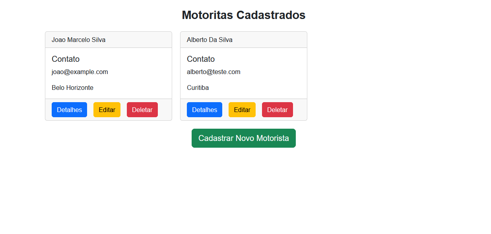
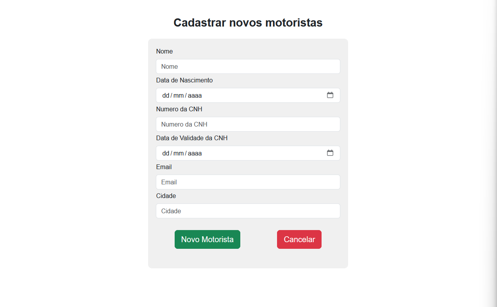
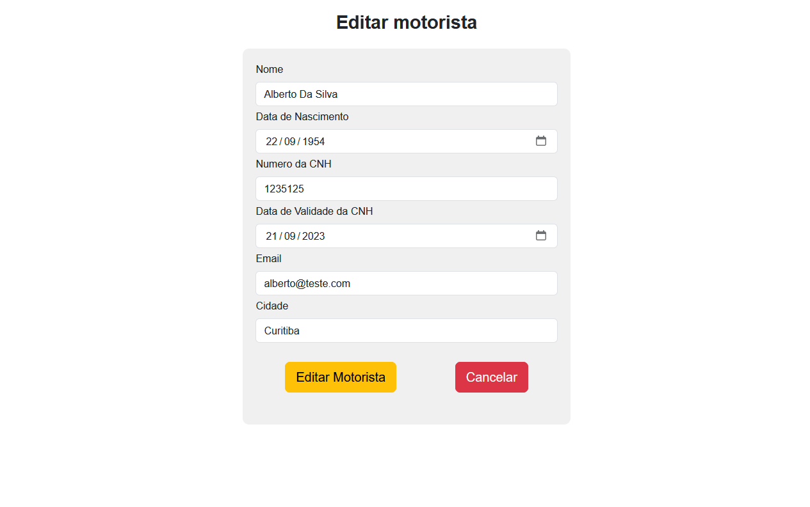
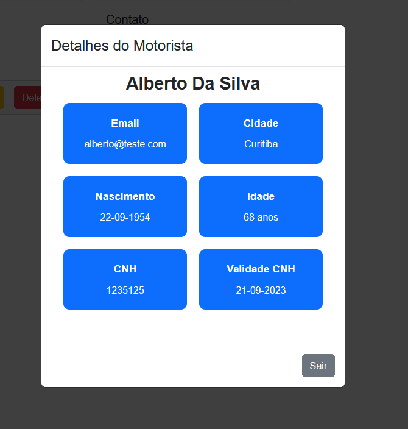

# Project: Transactions
# - Tecnologies
## Backend:
 - Clean Architecture
 - .NET 7
 - Entity Framework Core
 - AutoMapper
 - XUnit

## Frontend:
 - React with Vite.JS
 - Bootstrap
 - Styled Components

## Reverse Proxy
 - Ngnix

## Database:
 - PostgresSQL

# - Deploy
## Requirements to Deploy:
 - Linux
 - Docker
 - Docker Compose

## How deploy:
First, make sure that the ports 3001, 2345 and 5000 are not in use.

In the root directory, execute the following command:

```bash
docker-compose up -d --build
```

Upon successful execution, three containers will be created with their respective ports:

 - frontend-container
    - reverse-proxy(3001)
 - backend-container  (5000)
 - database-container (2345)

Access the UI via: http://localhost:3001

## Tests:
The backend has 13 unit tests. To run them, either utilize Visual Studio Test Explorer or execute the following command in the root directory:

```bash
(cd backend/Transactions/Transactions.UnitTests/ && dotnet test)
```

# - UI

## Home


## Register


## Update


## Delete Modal


## Detail Modal


# - API

## Endpoint: GETAll http://localhost:5000/api/DriverManagement/drivers
* Functionality: GET all Drivers
```JSON
[
  {
    "name": "string",
    "dateOfBirth": "1994-09-21T03:00:00Z",
    "drivingLicenseNumber": "12e541235",
    "drivingLicenseExpirationDate": "2040-09-21T03:00:00Z",
    "email": "joao@example.com",
    "city": "Belo Horizonte",
    "id": "c15e9c4b-efed-4af5-b233-2b68db943e0b"
  },
  {
    "name": "string",
    "dateOfBirth": "1954-09-22T03:00:00Z",
    "drivingLicenseNumber": "1235125",
    "drivingLicenseExpirationDate": "2023-09-21T03:00:00Z",
    "email": "alberto@teste.com",
    "city": "Curitiba",
    "id": "eb91c5ba-8c63-4041-b668-c39281138607"
  }
]
```

## Endpoint: GETBYID http://localhost:5000/api/DriverManagement/drivers/:id
* Functionality: GET an especific driver that by registered in ID
* Param (id): Guid from a registered driver.
```JSON
{
	"name": "string",
	"dateOfBirth": "2023-09-19T23:14:51.725Z",
	"drivingLicenseNumber": "string",
	"drivingLicenseExpirationDate": "2023-09-19T23:14:51.725Z",
	"email": "string",
	"city": "string",
	"id": "3fa85f64-5717-4562-b3fc-2c963f66afa6"
}
```


## Endpoint: CREATE http://localhost:5000/api/DriverManagement/drivers
* Functionality: POST a driver to register in database
* Param (Driver): Driver Entity.
```JSON
{
	"name": "string",
	"dateOfBirth": "2023-09-19T23:14:51.725Z",
	"drivingLicenseNumber": "string",
	"drivingLicenseExpirationDate": "2023-09-19T23:14:51.725Z",
	"email": "string",
	"city": "string",
	"id": "3fa85f64-5717-4562-b3fc-2c963f66afa6"
}
```


## Endpoint: UPDATE http://localhost:5000/api/DriverManagement/drivers
* Functionality: PATH a driver to update in database his data
* Param (Driver): Driver Entity.
```JSON
{
	"name": "string",
	"dateOfBirth": "2023-09-19T23:14:51.725Z",
	"drivingLicenseNumber": "string",
	"drivingLicenseExpirationDate": "2023-09-19T23:14:51.725Z",
	"email": "string",
	"city": "string",
	"id": "3fa85f64-5717-4562-b3fc-2c963f66afa6"
}
```

## Endpoint: DELETE http://localhost:5000/api/DriverManagement/drivers/:id
* Functionality: DELETE an especific driver that by registered in ID from database
* Param (id): Guid from a registered driver.


